

    

         
        
    

         
    

        
	

            
    《纸张计数显示装置实验报告》
     
     
    <table style="border:none;text-align:center;width:72%;font-family:仿宋;font-size:14px; margin: 0 auto;">
    <tbody style="font-family:方正公文仿宋;font-size:12pt;">
    	<tr style="font-weight:normal;"> 
    	  </tr>
    	<tr style="font-weight:normal;"> 
    		<td style="width:20%;text-align:right;">授课教师</td>
    		<td style="width:2%">：</td> 
    		<td style="width:40%;font-weight:normal;border-bottom: 1px solid;text-align:center;font-family:华文仿宋">王酉  杨江</td>     </tr>
    	<tr style="font-weight:normal;"> 
    		<td style="width:20%;text-align:right;">成员姓名</td>
    		<td style="width:2%">：</td> 
    		<td style="width:40%;font-weight:normal;border-bottom: 1px solid;text-align:center;font-family:华文仿宋"> 郭嘉哲  3190101002   </td>     </tr>
        <tr style="font-weight:normal;"> 
    		<td style="width:20%;text-align:right;">成员姓名</td>
    		<td style="width:2%">：</td> 
    		<td style="width:40%;font-weight:normal;border-bottom: 1px solid;text-align:center;font-family:华文仿宋"> 梁毅浩 3190104716   </td>     </tr>
        <tr style="font-weight:normal;"> 
    		<td style="width:20%;text-align:right;">成员姓名</td>
    		<td style="width:2%">：</td> 
    		<td style="width:40%;font-weight:normal;border-bottom: 1px solid;text-align:center;font-family:华文仿宋"> 余丛杉 3190103165  </td>     </tr> 

​    

<!-- 注释语句：导出PDF时会在这里分页 -->

## 实验要求

+ 设计并制作纸张计数显示装置

+ 两块平行极板（极板 A、 极板 B）分别通过导线 a 和导线 b 连接到测量显示电路，装置可测量并显示置于极板 A 与极板 B 之间的纸张数量。

  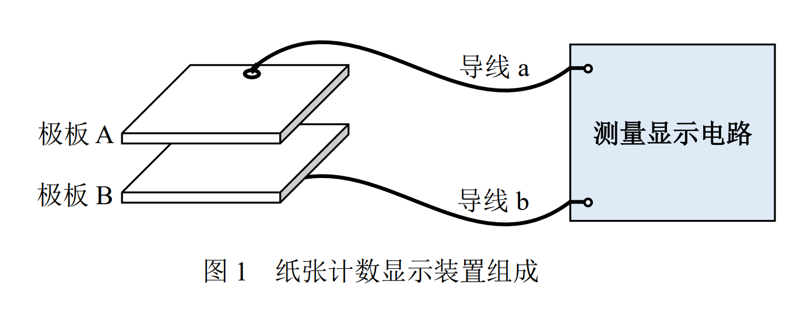

+ 基本要求

  +  极板 A 和极板 B 上的金属电极部分均为边长 50mm±1 mm 的正方形， 导线 a 和导线 b 长度均为 500mm±5mm。测量显示电路应具有“自校 准”功能，即正式测试前，对置于两极板间不同张数的纸张进行测量， 以获取测量校准信息。
  +  测量显示电路可自检并报告极板 A 和极板 B 电极之间是否短路。
  + 测量置于两极板之间 1~10 张不等的给定纸张数。每次在极板间放入被测纸张，一键启动测量，显示被测纸张数并发出一声蜂鸣。 每次测量从按下同一测量启动键到发出蜂鸣的时间不得超过 5 秒钟， 在此期间对测量装置不得有任何人工干预。

+ 发挥部分

  + 极板、导线均不变，测量置于两极板之间 15~30 张不等的给定纸张数。 对测量启动键、显示蜂鸣、测量时间、不得人工干预等。

  + 极板、导线均不变，测量置于两极板之间 30 张以上的给定纸张数。 对测量启动键、显示蜂鸣、测量时间、不得人工干预等。

## 实验设备

+ PC机
+ keil5
+ STM32F103RCT6核心板
+ FDC2214模块
+ OLED模块
+ $5cm\times5cm$两片极板
+ 屏蔽双绞线
+ 亚克力板
+ 绝缘体重物

## 实验原理　　

### FDC2214模块

​	选用FDC2214测量两极板间电容，为高分辨率（28位）、多通道的电容数字转换器。与传统的开关电容架构相比，此芯片使用LC谐振器作为传感器，窄带架构可以实现高抗电磁干扰能力，并大大降低噪声。

#### 变间隙式电容传感器

​	两极板构成一变间歇式电容传感器，在上下极板放入纸张，产生微小移动，即相应改变板间距d，电容量C与极板间距d的关系式如下所示：
$$
C=\frac{\epsilon_0\epsilon_rA}{d}
$$
​	其中$\epsilon_0$是真空中的介电常数，$\epsilon_r$是复印纸的相对介电常数，A是极板面积，我们采用的是$5cm\times5cm$单面覆铜板，又因为板间距d与纸张数N成正比，故纸张数N与电容量C存在反函数关系。

#### LC谐振

​	LC谐振电路包括并联电路和串联电路两种结构类型，电感L、电容C和外加信号源u组成的并联谐振电路如图所示。其中r是电感L的损耗电阻，电容的损耗一般忽略不计。

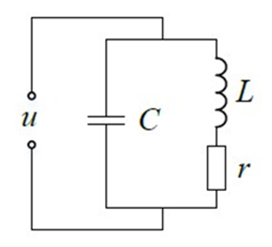

​	在该电路中，随着储能在电场和磁场之间的往返转移，电路中的电流和电压将不断地改变大小和极性，形成周而复始的振荡。当振荡持续维持时，称之为等幅振荡，也称为谐振。LC电路的谐振频率f为
$$
f=\frac{1}{2\pi \sqrt{LC}}
$$
​	则对于LC谐振器，电容的变化可体现为谐振频率的变化。

#### FDC2214测量原理与计算

​	FDC2214外接电容传感器极板，主要由谐振电路驱动器、多路复用器、内核和I2C接口组成，其功能框图如图所示。在芯片每个检测通道的输入端首先连接一个初始电感和电容，组成LC电路，被测电容传感端与该电路相连接，共同构成一个谐振电路，随着待测电容的变化，其输出的谐振频率$f_{SENSOR}$也会发生变化。在芯片内部，谐振电路驱动器通过多路复用器连接到测量和数字化传感器频率$f_{SENSOR}$的核心，该内核使用一个参考频率fCLK去测量传感器频率，最终每个通道的输出与$\frac{f_{SENSORRE}}{f_{REF}}$成比例关系。I2C接口用于与MCU通信。传感器在差分配置下，待测电容CSENSOR可由下式计算得到下式：
$$
C_{SENSOR}=\frac{1}{L\times(2\pi\times f_{SENSOR})^2}-C
$$
​	其中，C是与待测电容并联的初始电容值。而FDC2214传感器频率$f_{SENSOR}$与输出数字量DATA具体的关系式为：
$$
f_{SENSOR}=\frac{CH\_FIN\_SEL\times f_{REF}\times DATA}{2^28}
$$
​	其中CH_FIN_SEL是传感器频率$f_{SENSOR}$​的分频系数，$f_{REF}$​是参考时钟$f_{CLK}$​分频后的信号频率。又CSENSOR与纸张数N成反比，可得
$$
(k_1\frac{1}{N}+C)\times L=k_2\times\frac{1}{f_{REF}^2\times DATA^2}
$$
​	其中$k_1、k_2$均为大于零的常数。

​	根据已校准的点及原始出厂数据，由斜率拟合出所有新的校准点，存入数组`FDC2214CalibrateValue[MaxPaperNum]`中，即可计算出纸张数量。

以下为`纸张数-厚度`图：

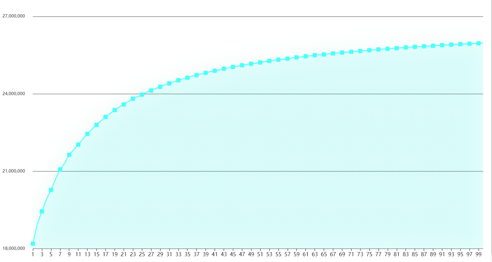

### OLED模块

​	OLED（Organic Light-Emitting Diode），又称为有机电激光显示、有机发光半导体（Organic Electroluminescence Display，OLED）。OLED属于一种电流型的有机发光器件，是通过载流子的注入和复合而致发光的现象，发光强度与注入的电流成正比。OLED在电场的作用下，阳极产生的空穴和阴极产生的电子就会发生移动，分别向空穴传输层和电子传输层注入，迁移到发光层。当二者在发光层相遇时，产生能量激子，从而激发发光分子最终产生可见光。

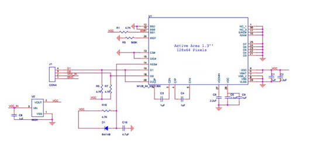

### 系统框图

### 流程图

#### 主逻辑

#### 按键检测逻辑

.png)

## 实验内容

### FDC2214读入模块

+ 通过`FDC_Read(u8 reg)`函数读取FDC2214寄存器数据
  + IIC读2个字节
  + reg：寄存器地址
  + return读到的数据
+ 通过`FCD2214_ReadCH(u8 index)`得到通道x转换后的线路电容数据
  + index： 0 -> CH0 ;	1 -> CH1;	2 -> CH2;	3 -> CH3
  + 实验中我们用通道一读取
+ 通过`FilteredFCD2214ReadCH(unsigned char index)`对读取值除去最小最大取8次平均滤波

### 按键模块

+ 矩阵键盘采用行扫描法进行`keyscan()`

+ 独立按键添加了长按复位功能

+ 按键功能

  
  
  

### 显示模块

+ 用`OLED_ShowStr(unsigned char x, unsigned char y, unsigned char ch[], unsigned char TextSize)`显示英文字符
  + `x,y` 为起始点坐标(x: 0~127, y: 0~7);
  + `ch[]` 为要显示的字符串
  + `TextSize` 为字符大小
+ 用`OLED_ShowCN(unsigned char x, unsigned char y, unsigned char Nn)` 显示中文字符
  + `x,y` 为起始点坐标(x: 0~127, y: 0~7);
  + 先对汉字取模，并把所有用到的汉字存入`Hzk[]`中，进行提取显示

### 彩蛋

快来找触发彩蛋的开关吧！

## 实验总结

### 实验结果与分析

#### 	 校准模式

​      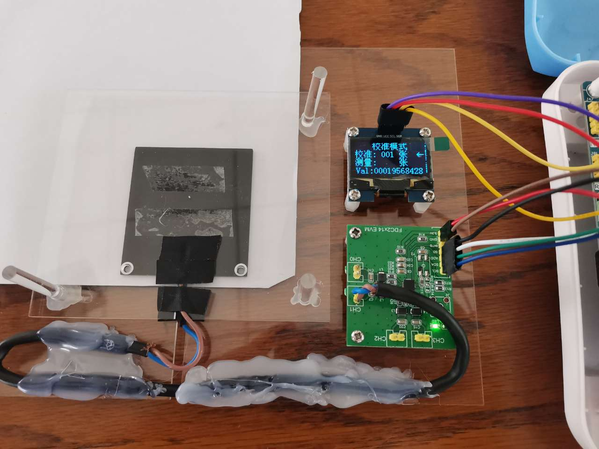            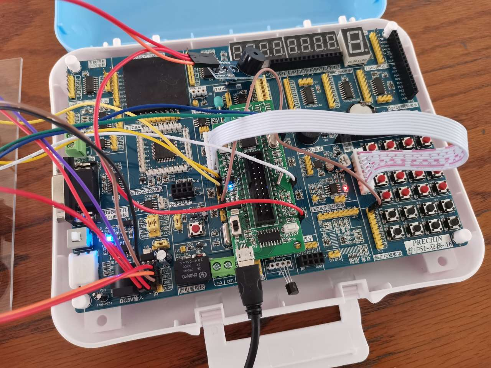

#### 短路

​      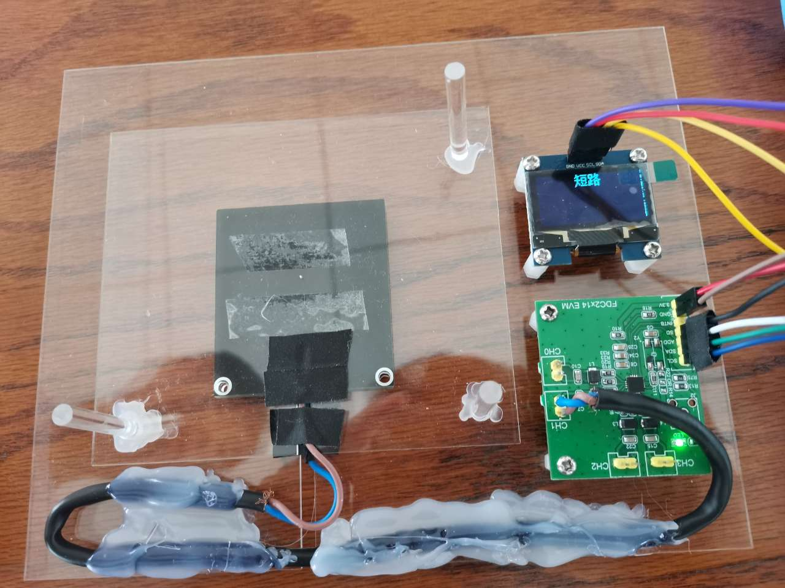            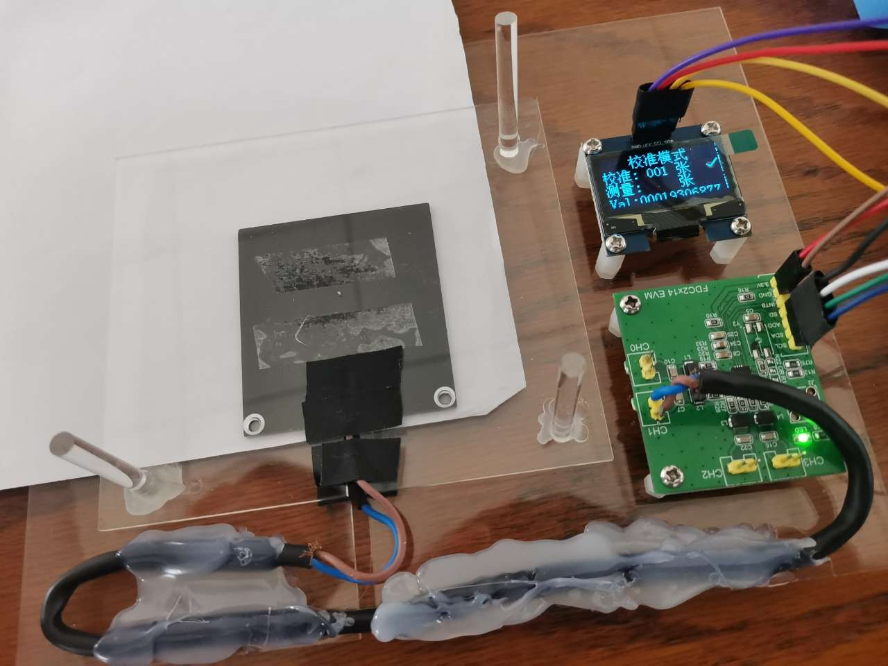

#### 校准成功

​     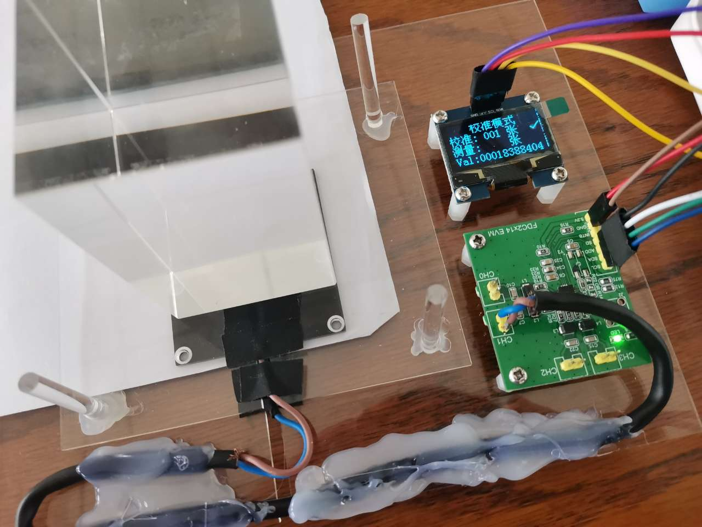             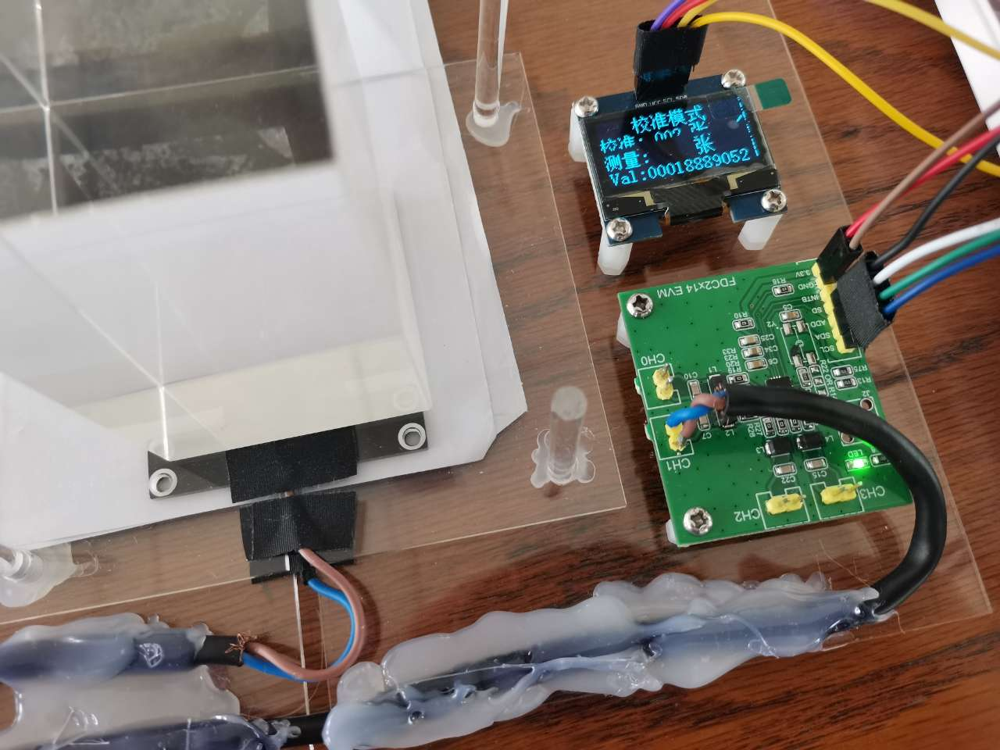

#### 是否保存数据

​     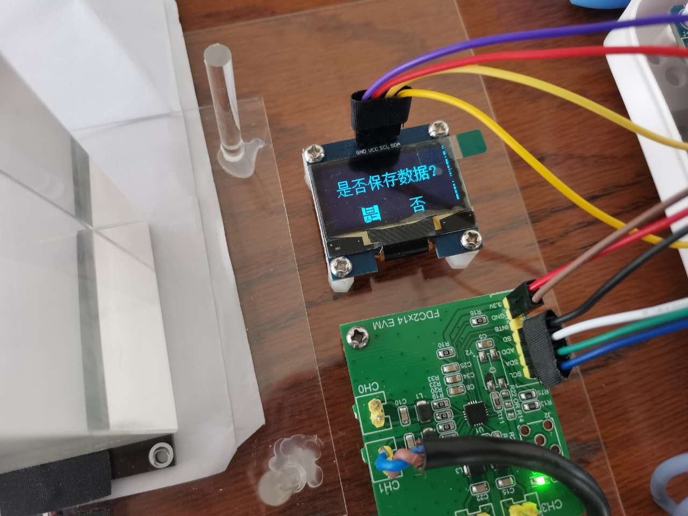             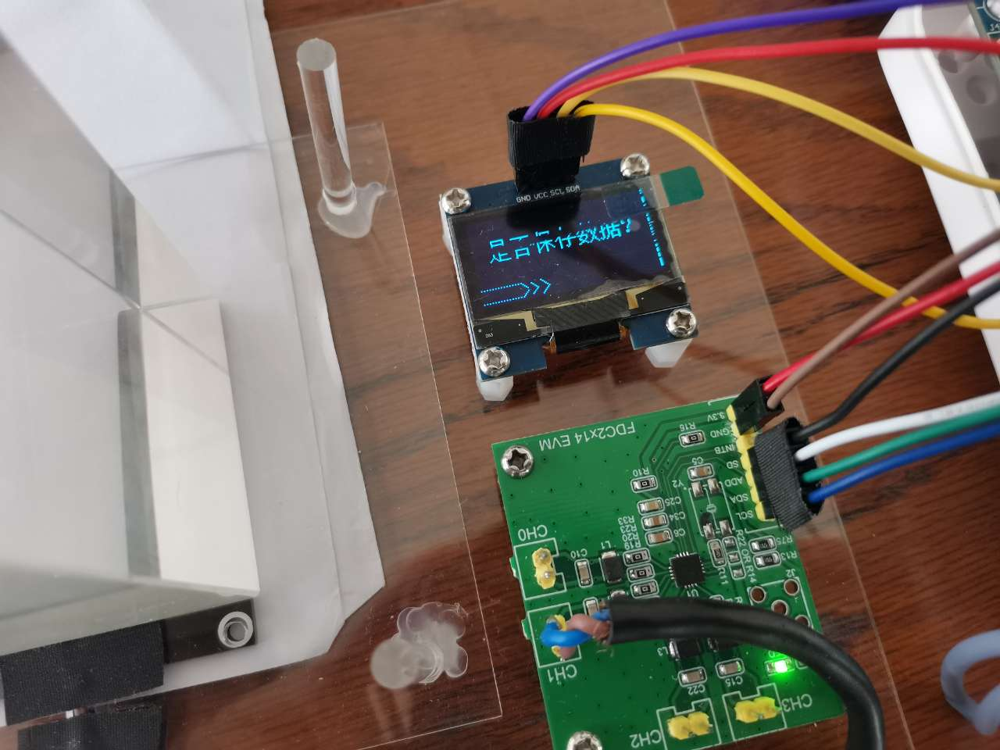

#### 保存成功

​                                      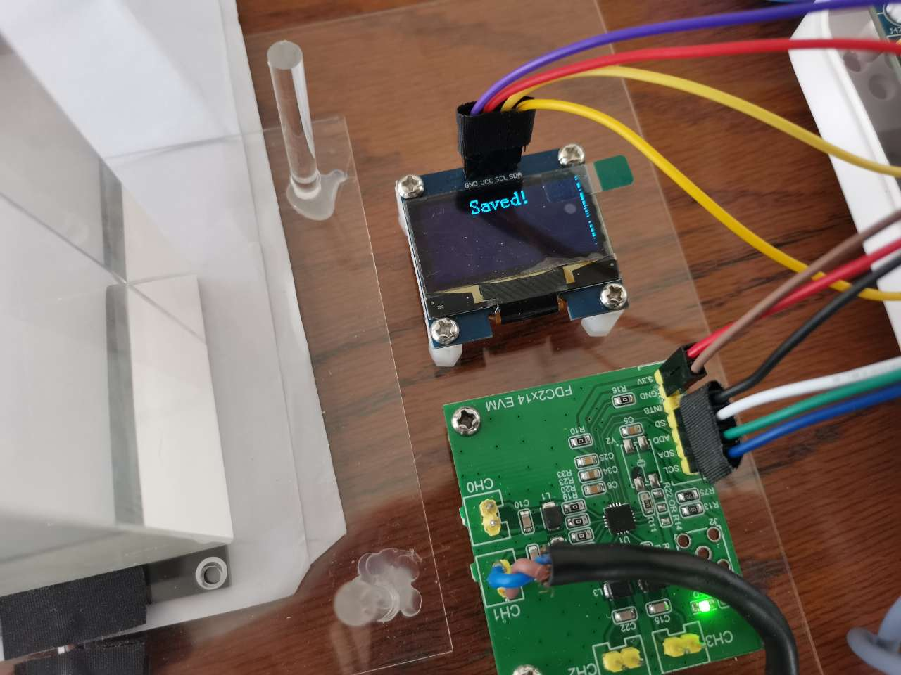      

#### 测量模式

​            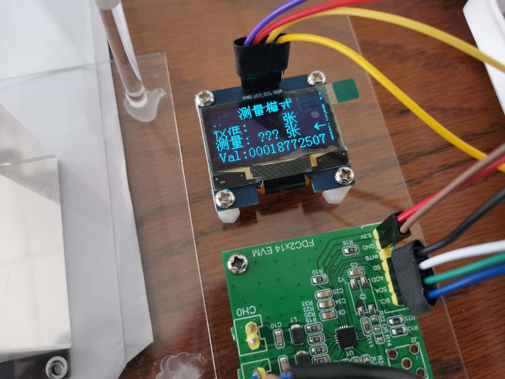               

#### 复位

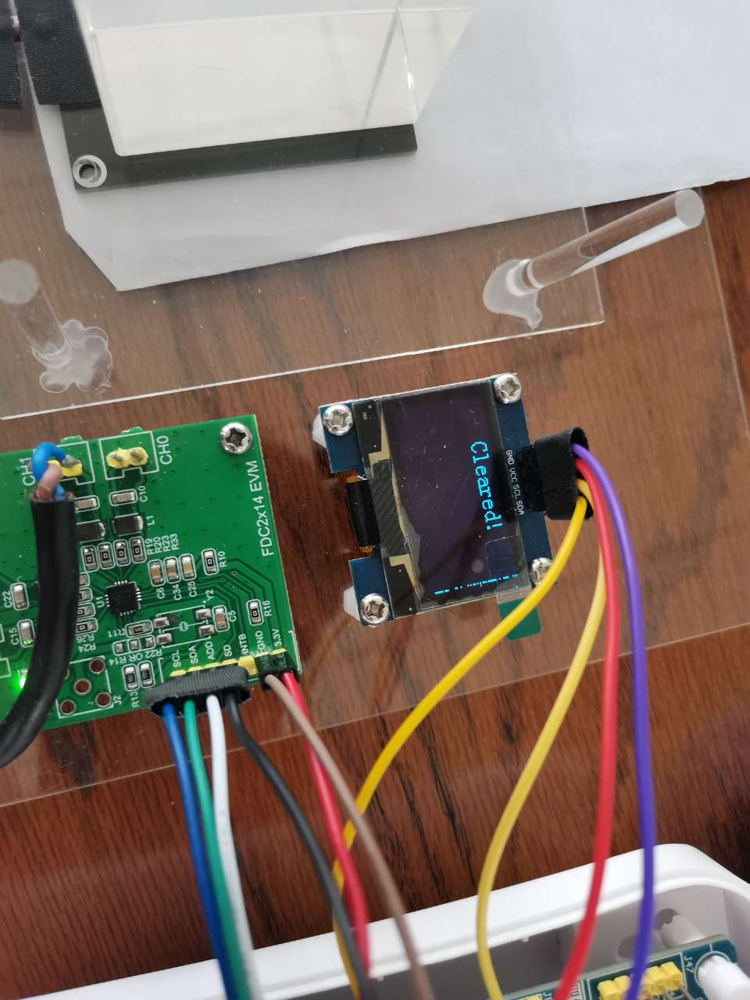

   经测量，当纸张数量小于等于100张时，我们的装置测量较为精确。

### 讨论、心得

　 余丛杉：

​	此次实验我们购买了FDC2214模块、OLED模块，定制亚克力板，配合stm32，在例程的基础上魔改代码。模块清晰，主要的任务是各个模块的通信连接，我们采用IIC通信方式，研究了芯片读入输出的API，在此基础上实现各个模块的连接。再根据已校准的点及原始出厂数据，由斜率拟合出所有新的校准点，存入数组，查表即可获得纸张数目，在完成基本的任务之后，我们进一步优化了显示模块、按键模块，考虑用户体验，我们试图加上蜂鸣器。但在蜂鸣器的优化过程中，我们发现蜂鸣器无法正常工作，不管管脚输出高电平还是低电平，蜂鸣器都不响。故我们单独淘宝了蜂鸣器，正常工作后，设置合理的功能。在优化显示模块时，我们添加了必要的提示信息，使操作更为简单。其中用到的中文字符需提前取模存入数组，英文字母可以直接显示；在优化按键模块时，我们使用了矩阵键盘，使得上下左右中的按键符合物理位置，操作更为简便。总之，这次实验，收获颇多。

​	郭嘉哲：

​	由于我们购买的是现成的FDC2214模块，其测量精度比较高，且我们采用重物将标准的纸张压紧，故我们在调试的过程中没有遇到错误率很高的情况。该模块有相应的参考程序，我们直接调用就可以显示对应的通道的电容值，因此我们把主要的精力花在了显示逻辑上，我们使用矩阵键盘为主要控制显示，辅助使用独立按键控制中断以便于和定时器相匹配。

​	通过本次实验，我理解了IIC的通讯原理，在编写OLED的显示逻辑代码过程中对其有了更进一步的认识。与此同时，我也对stm32中Flash的操作有了一定的了解。实验的过程中，我们遇到的一个非常大的问题就是对于短路的显示，我们发现当两极板用导线连接在一起的时候得到的电容值符合短路的预期情况，但在两极板直接贴合的情况下却不显示短路，我们重新焊接过极板，也重新焊接过在模块上的连线，最后该问题也是莫名其妙就得到了解决。同时，我们也出现了开发板套件上无论如何输出值，蜂鸣器都不会响的问题，最后买了个独立的蜂鸣器模块，才解决了这个问题。硬件的问题弄得我们苦笑不得，这也是比较耗费时间和精力的地方。对于校准而言，如果所有纸张数的测试点都需要在实际测试前一个个校准过去，那么这其对于测量而言不够友好，我们采用预先将可能的校准值储存起来，通过实际的几个校准点和预先的校准值的变化趋势，推断出可能的实际的校准曲线，并在测试中加以使用。这样只需校准少数几个点，就可以实现较大范围的测量，这是我们的程序逻辑中比较巧妙的一点。

​	另外值得一提的是，我们通过一定数量的标志符辅助我们记录OLED显示的页面，其逻辑思路与我在C大程的大作业中使用大量标志符定义每次刷新时显示的页面非常相似，我也感受到了交互界面的相似性。

​	梁毅浩：

​	本次实验我主要负责元件采购、硬件组转、代码整理编写工作。由于对FDC2214模块不是很熟悉，我在github上找了一些例程，参考历程进行了修改，调整了部分程序执行逻辑，同时参考了往届的结构设计出更方便、更准确的测量结构，比如运用套杆确定极板位置使每次放入纸张后两极板能始终保持正对，电容测量更加准确。oled的显示模块也是了解了显示原理后参考例程代码，创建了自己的字库和图形库。按键部分则更改之前写过的矩阵按键代码，结合相应的需求对应特定的功能。总的来说这次实验更像是在前人成果的基础上，做出一些修改使得逻辑、操作更加合理，显示更加完善。以后再建立自己的工程时也应参考前人的成果，从0到1难，从1到无穷易，借鉴前人成果的过程也是学习的过程，这样才能创造出更优秀的结果。

